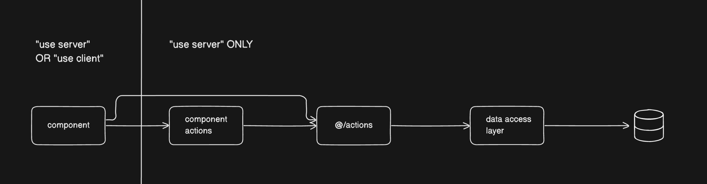

# Actions Architecture

Eraser Diagram: https://app.eraser.io/workspace/htbg7wsxwgzT8EP78cuJ

## Layers

| Layer                           | Responsibilities                                                                                                                                                                                                                                                                                                                                                                                                                                         |
| ------------------------------- | -------------------------------------------------------------------------------------------------------------------------------------------------------------------------------------------------------------------------------------------------------------------------------------------------------------------------------------------------------------------------------------------------------------------------------------------------------- |
| **component.tsx**               | - Calls `component.actions.ts` or `@/actions/entity.actions.ts` directly to interact with server - Responsible for ui, state, and form logic only                                                                                                                                                                                                                                                                                                     |
| **./component.actions.ts**      | - Logic specific for its respective component ie. updateUserTheme is a partial update using updateUser() in @/actions - Filter out irrelevant or sensitive info for each use case - Database transactions (multi query) &nbsp;&nbsp;- ie. Image upload needs to upload to blob, create new Image entity tied to user in db, and on failure rollback - Don't error handle here, let errors cascade to the component - Display toasts here? |
| **@/actions/entity.actions.ts** | - Validate session - Handle ACAB - Handle errors here - Protect data-access layer - Modified CRUD operations from data-access layer ie. getLinksByUserId - Atomic transactions (one thing at a time)                                                                                                                                                                                                                                      |
| **Data Access Layer**           | - ORM implementation - Direct to DB                                                                                                                                                                                                                                                                                                                                                                                                                   |
